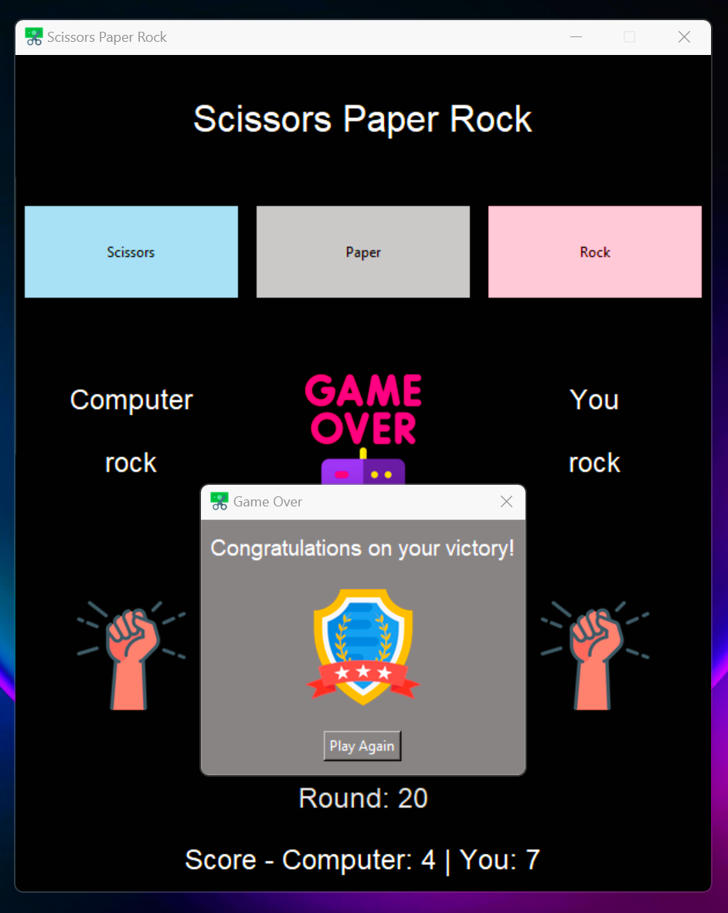

# Scissors Paper Rock

This repository contains a Python Tkinter application for playing the classic game of Scissors Paper Rock. The application allows users to play against the computer and keeps track of the scores and rounds.

## Description

The main script (`game.py`) includes the following features:

- **User Interface**: A graphical user interface built using Tkinter with buttons for selecting Scissors, Paper, or Rock.
- **Game Logic**: Handles the game logic, including user and computer choices, and determines the winner for each round.
- **Score Tracking**: Keeps track of the number of rounds played and the scores of both the user and the computer.
- **Custom Dialogs**: Displays custom dialog boxes with messages and images at the end of the game.
- **Images**: Uses images for representing choices and results.

## Screenshot


## Files Included

- `game.py`: Main script for the game.
- `icon.ico`: Icon file for the application window.
- `scissor.png`, `paper.png`, `rock.png`, `win.png`, `lose.png`, `draw.png`, `badge.png`, `over.png`: Image files used in the game.

## Usage

1. Clone the repository:
   ```bash
   git clone https://github.com/diwasbk/Scissor-Paper-Rock-Game.git

## Author

- [Diwas Bk](https://github.com/diwasbk)